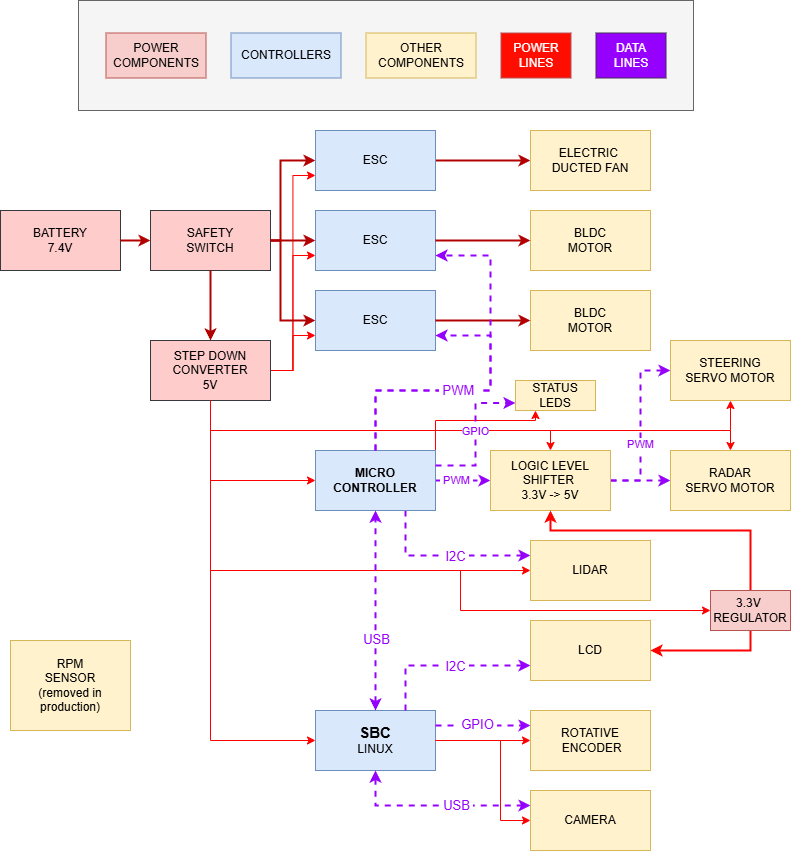
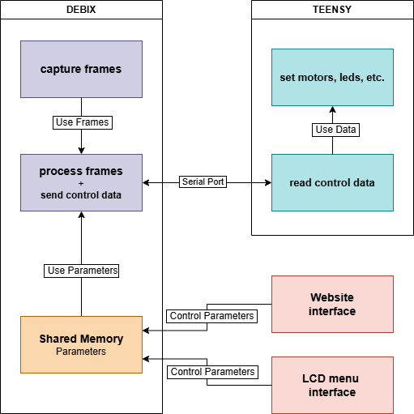
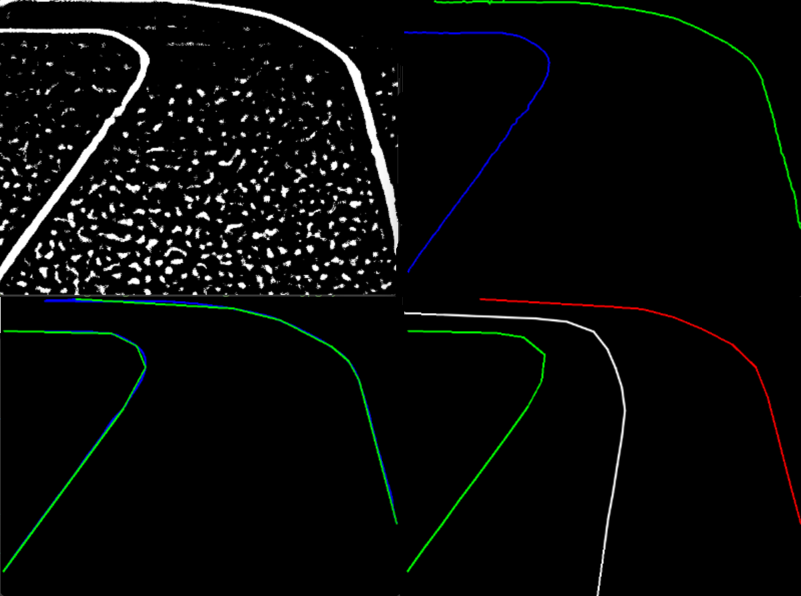
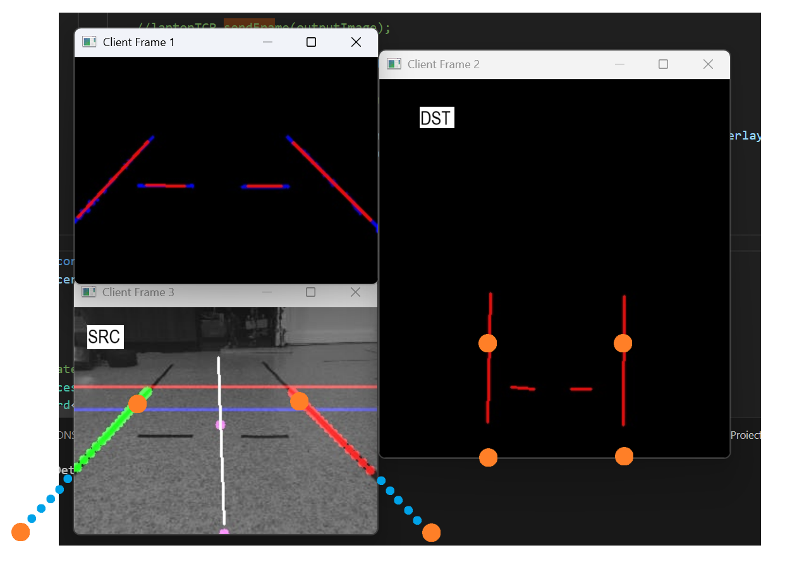
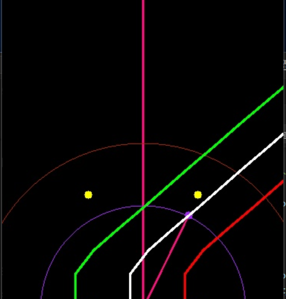

# Project Summary
I have a full thesis on this project in my native language. Online tools can easily translate all informations for better understanding. Thank you!
## Overview

This work presents the development of an autonomous vehicle for the NXP Cup competition, where the goal is to complete a predefined track without human intervention. The project combines both hardware components and custom-developed algorithms in order to achieve competitive performance.

For track detection, a camera mounted in the center of the car captures images in real time, processed using the OpenCV library. All image processing runs on the Debix Model B board, while a Teensy 4.0 microcontroller controls the actuators.

An important aspect of this work is the image processing pipeline (detailed in Section 4.3 of the thesis) and the use of the Bird’s Eye View technique, which improves perception of the surrounding environment. The main trajectory tracking algorithm is based on an enhanced version of Pure Pursuit (explained in Section 4.4), which relies on the midline of the track and the vehicle’s geometry. The improvement consists of dynamically adjusting the lookahead distance according to the vehicle’s speed and the curvature of the detected path.

Testing was conducted both on a custom-built track (with better grip than the competition’s) and on the official NXP Cup track. This difference in conditions initially affected system performance, but thanks to the interactive settings menu, parameters could be tuned on the day of the competition, resulting in satisfactory performance.

## Architecture

The system architecture is divided into two main components: hardware and software.

### Hardware Architecture

Processing Unit: Debix Model B (NXP i.MX 8M Plus, ARM Cortex-A53 quad-core @ 1.6 GHz, integrated NPU up to 2.3 TOPS) running Ubuntu Linux.

Microcontroller: Teensy 4.0 used for real-time control of the servo motor and dual rear motors.

Actuators:
* Steering via SPT5613 servo motor implementing Ackermann geometry.
* Propulsion via two DC motors mounted on the rear axle.
* Additional thrust from an EDF (Electric Ducted Fan) for straight-line speed.

Sensors:
* USB UVC camera for track detection.
* LiDAR (infrared) for obstacle detection and finish-line sensing.
* Rotary encoder for speed feedback.
* OLED display + rotary encoder for interactive settings menu.

Power System: Li-Po battery with step-down converters for stable voltage supply.

### Software Architecture

The software stack is split across the Debix board and the Teensy microcontroller:

Debix Board (Linux):
* Image acquisition using OpenCV.
* Preprocessing pipeline: thresholding, skeletonization, line detection, polyline simplification, midline generation.
* Perspective transformation (Bird’s Eye View) for improved lane perception.
* Path tracking using Pure Pursuit with dynamic lookahead distance.
* TCP communication with Teensy for sending steering and speed commands.
* Interactive Python menu for adjusting parameters in real time (via shared memory and OLED display).

Teensy Microcontroller:
* Reads serial commands from the Debix.
* Generates PWM signals for the steering servo and rear motors.
* Safety features, including emergency remote stop and refresh rate control.

This modular architecture ensures real-time image processing on the Debix while leaving low-level actuator control to the Teensy, balancing performance and reliability.

## Algorithms

The software relies on a multi-stage pipeline for perception and control. The main steps are lane detection, Bird’s Eye View transformation, and path tracking with Pure Pursuit.

### Lane Detection

The camera feed is processed in real time using OpenCV:
* Preprocessing – thresholding to isolate lane markings from the background.
* Skeletonization – reducing the lane shape to its central line for robustness.
* Line detection and simplification – converting the skeleton into a polyline with fewer points, reducing computational load.
* Midline generation – computing the midpoint between left and right lane boundaries to represent the drivable path.

This stage outputs a discrete midline of the track, represented as a set of points.

### Bird’s Eye View Transformation

To improve perception accuracy, a perspective transform is applied to obtain a Bird’s Eye View (top-down) of the track.

This reduces distortions from the forward-facing camera.
Curves and straight segments are easier to analyze in this perspective.
The transformation matrix is calibrated once for the camera position and then applied consistently during runtime.

### Pure Pursuit with Dynamic Lookahead

Path tracking is implemented using an enhanced Pure Pursuit algorithm:
The algorithm selects a lookahead point on the midline, ahead of the car’s current position.
The steering angle is computed geometrically based on the curvature required to reach this point.
Dynamic lookahead distance:
* Increases with higher vehicle speed.
* Decreases for tighter curves (shorter radius).
This adaptation improves both stability on straights and maneuverability in curves.

The output is a steering command sent to the Teensy, while a separate speed control strategy adjusts motor power to balance agility and stability.
